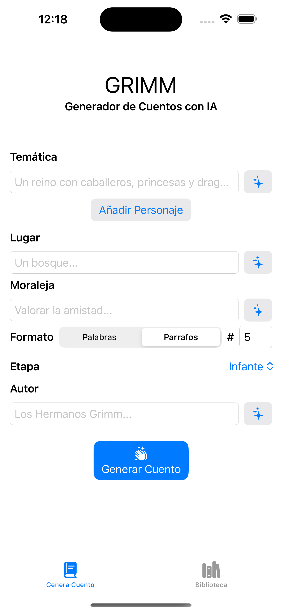
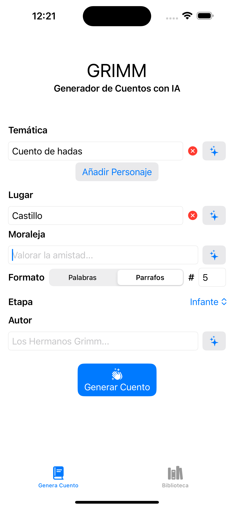
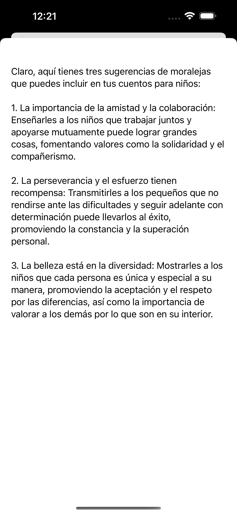
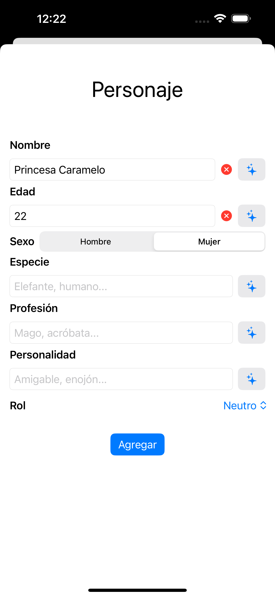
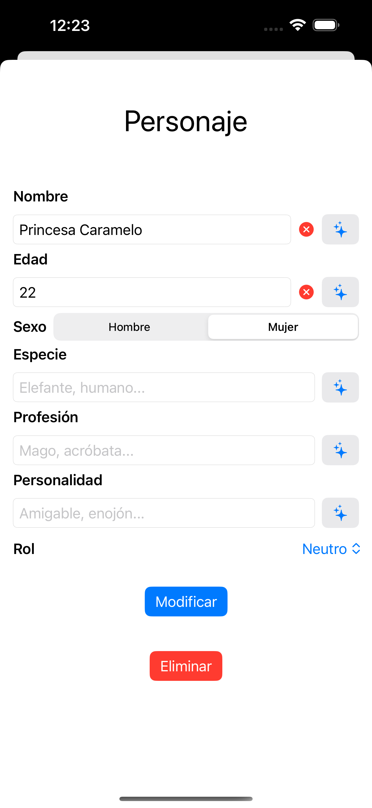
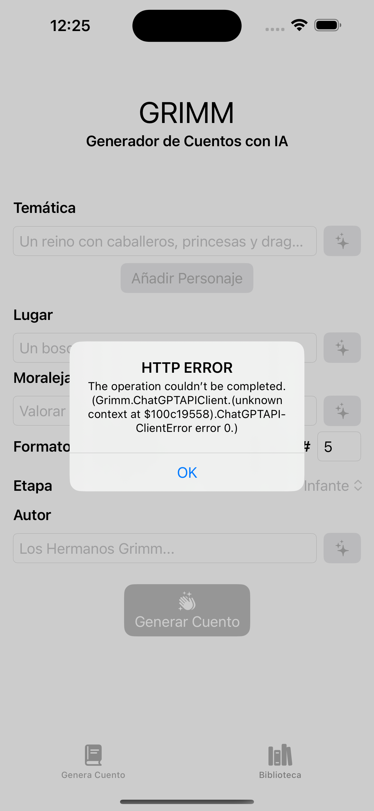
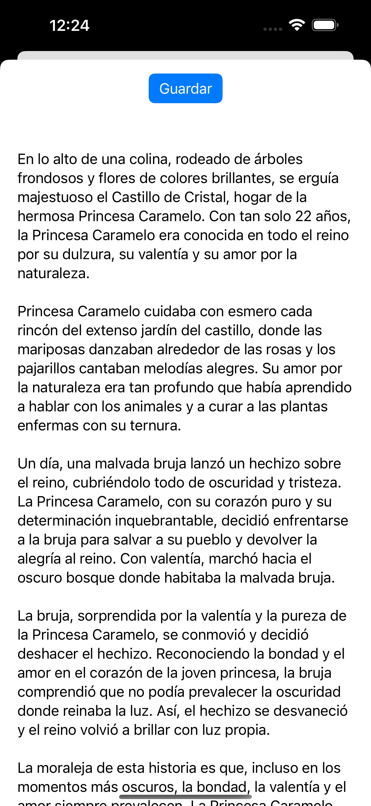
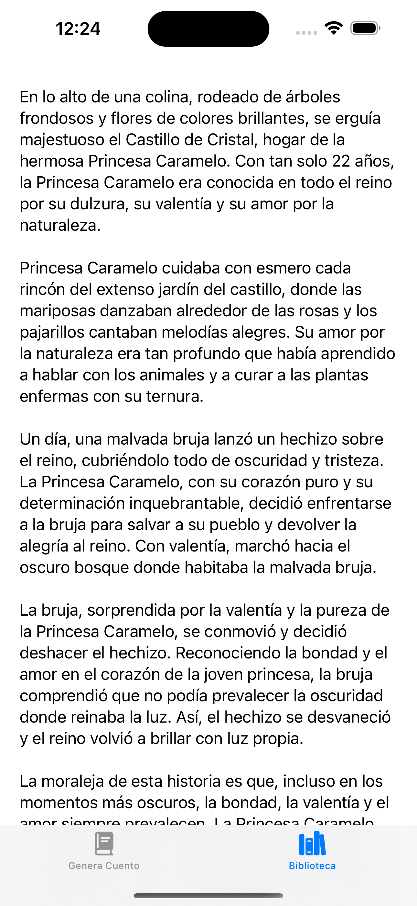

# Grimm: StoryTeller AI
*Por: Brian Jiménez Moedano*

*Marzo 2024*

## Descripción

**Gimm: StoryTeller AI** es una aplicación que te ayuda a **generar cuentos e historias para niños en cuestión de segundos, con la ayuda de la IA.** Este proyecto está construido con **SwiftUI y una arquitectura MV**. Incorpora **el API de OpenAI chatGPT para la generación de cuentos.**

## Características

- Aplicación que permite generar cuentos para niños.
- Diseño de arquitectura **MV.**
- Uso del API de openAI **ChatGPT.**
- El usuario puede especificar uno o más parámetros para la generación de un cuento para niños, entre los que se encuentra: temática, moraleja, número de parrafos o palabras, entre otros.
- El usuario puede pedir sugerencias para llenar los parámetros del cuento a generar.
- El usuario puede incluir o no, personajes en el cuento, especificando parámetros como: nombre, profesión, rol, entre otros.
- El usuario puede optar por dejar todos los parámetros vacíos y dejar que la IA genere un cuento aleatoriamente.
- El usuario puede almacenar un cuento si este fue de su agrado y lo quiere releer en el futuro.
- Uso del API **SwiftUI** para la interfaz de usuario.

## Cómo Utilizarla

Al abrir la aplicación, el usuario puede navegar entre el generador de cuentos y la biblioteca de cuento guardado.

El generador de cuentos presenta al usuario todos los **parámetros disponibles para generar o personalizar el cuento generado por medio de IA.** El usuario puede optar por **llenar uno, varios, todos o ninguno de los parámetros, esto último hará que la IA genere un cuento de manera aleatoria.** También puede pedir **sugerencias a la IA sobre como llenar dichos parámetros** por medio del **botón ubicado en la parte derecha de cada campo.**

También puede optar por **crear uno o más personajes para ser incluidos en el cuento**, en cuyo caso tiene disponibles **parámetros para personalizarlo.**

El usuario puede **modificar, agregar o eliminar** algún personaje del cuento.

Al hacer tap sobre el botón de **generar cuento**, la App se comunicará con el API de openAI para generar el cuento con los parámetros especificados por el usuario, en caso de existir algún **error** en la comunicación, se presentará al usuario por medio de una **alerta nativa**, en caso **exitoso**, se presentará una **vista modal con el cuento generado**.

El usuario puede optar por **guardar el cuento localmente**.

El usuario puede acceder al cuento guardado desde la opción de **Bilbioteca**.

## Tecnologías/Frameworks

- **SwiftUI:** Para el diseño de la interfaz de usuario.
- **OpenAI ChatGPT API:** Para la generación del cuento.
- **MV:** Como arquitectura de diseño principal.
- **AppStorage**: Como persistencia de datos locales para almacenar un cuento generado.

## Licenciamiento

- **GNU GPLv3**